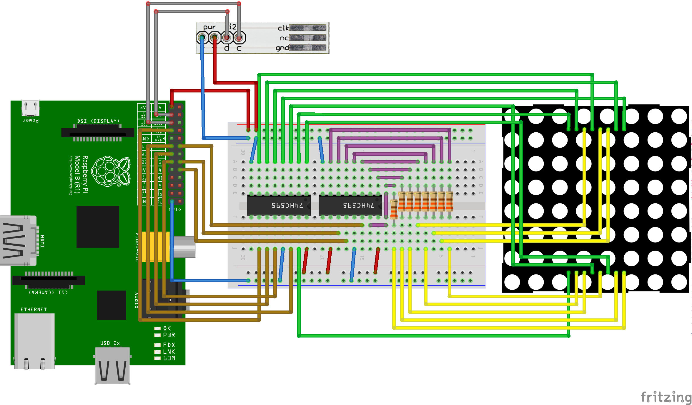

wiiproject
==========

Un juego de Snake para Raspberry Pi en una matriz de leds y controlado por un Wii Nunchuck.

Este proyecto fue hecho con el fin de ser un ejercicio para el uso de GPIOs y comunicación I2C en la Raspberry Pi. Consiste en emular el juego de Snake en una matriz de leds de 8x8 controlando el movimiento de la serpiente con el joystick del control para llevarla hacia la comida y hacer que crezca. Si la serpiente llegara a chocar consigo misma el juego termina.

Un video demostrativo de este proyecto se puede ver [aquí](http://bit.ly/1F4Kg6V).

Instalación
-----------

#### I2C

Para poder utilizar el control Wii Nunchuck con la Raspberry Pi se debe configurar el puerto I2C, instalar los módulos de Python para su uso y habilitarlos para que sean cargados al inicial la Raspberry Pi. El blog de Adafruit tiene un [artículo](https://learn.adafruit.com/adafruits-raspberry-pi-lesson-4-gpio-setup/configuring-i2c) detallando cómo se configura el uso de los puertos I2C y SPI.
Todo esto se puede hacer utilizando el script configuracion.sh. La instalación requiere de permisos de administrador, por lo que es necesario ejecutar el script con permisos sudo.

Construcción
------------

#### Lista de materiales
* 1x Matriz de leds 8x8.
* 2x Registro de corrimientos [74HC595](https://www.sparkfun.com/datasheets/IC/SN74HC595.pdf). (Este [artículo](http://bildr.org/2011/02/74hc595/) explica muy bien cómo usar estos registros.)
* 8x Resistencias 330 $\omega$
* 1x Control [Wii Nunchuck](http://www.robotshop.com/media/files/PDF/inex-zx-nunchuck-datasheet.pdf).
* 1x Adaptador [WiiChuck](https://www.sparkfun.com/products/9281).
* 1x Raspberry Pi.
* Cables. Muchos cables.

#### Schematics

Abajo se muestra el diagrama de conexiones para el circuito que lee el control Wii Nunchuck, la interfaz de la Raspberry Pi hacia los registros de corrimiento y las salidas de los registros hacia la matriz de leds.

Docs
----
Puedes consultar la referencia de los objetos que se usan en el programa [aquí](http://wiiproject.rtfd.org).

